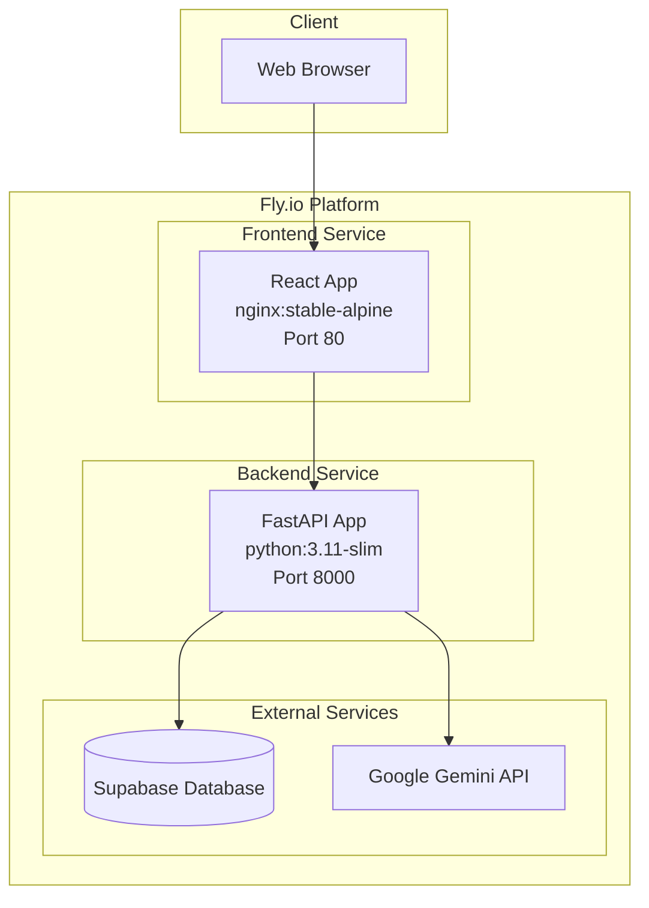
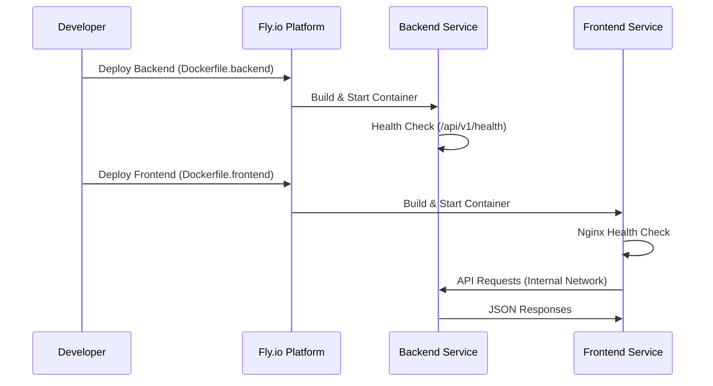

# Design Document

## Overview

The Fly.io dual-service deployment architecture separates the SmartResume AI application into two independent services: a Python FastAPI backend and a React frontend. This design enables independent scaling, deployment, and maintenance of each service while maintaining optimal performance and security.

The deployment leverages Fly.io's container orchestration platform with multi-stage Docker builds for both services, ensuring minimal container sizes and fast deployment times. The architecture follows cloud-native principles with proper service discovery, health monitoring, and configuration management.

## Architecture

### Service Architecture



### Deployment Flow



## Components and Interfaces

### Backend Service (Dockerfile.backend)

**Base Image Strategy:**

- Builder Stage: `python:3.11-slim` with build tools
- Production Stage: `python:3.11-slim` with runtime dependencies only

**Key Components:**

- FastAPI application server (uvicorn)
- Python dependencies from requirements.txt
- System dependencies: poppler-utils, tesseract-ocr, libmagic1
- Health check endpoint: `/api/v1/health`
- Security: Non-root user execution

**Port Configuration:**

- Internal Port: 8000 (FastAPI default)
- Fly.io Service Port: 8000 (internal access)

### Frontend Service (Dockerfile.frontend)

**Base Image Strategy:**

- Builder Stage: `node:20-alpine` for npm build process
- Production Stage: `nginx:stable-alpine` for static file serving

**Key Components:**

- Vite build system (npm run build)
- Static assets in `/usr/share/nginx/html`
- Nginx configuration for SPA routing
- Build artifacts from `frontend/dist`

**Port Configuration:**

- Internal Port: 80 (nginx default)
- Fly.io Service Port: 80/443 (public access)

### Fly.io Configuration (fly.toml)

**Service Definitions:**

- Separate app configurations for backend and frontend
- HTTP services with appropriate port mappings
- Health check configurations
- Environment variable management
- Resource allocation settings

## Data Models

### Docker Build Context

```yaml
Backend Build Context:
  - Source: ./backend/
  - Dockerfile: ./Dockerfile.backend
  - Ignore: .dockerignore patterns
  - Entry Point: backend/app/main.py

Frontend Build Context:
  - Source: ./frontend/
  - Dockerfile: ./Dockerfile.frontend
  - Build Output: frontend/dist/
  - Static Assets: nginx web root
```

### Environment Configuration

```yaml
Backend Environment Variables:
  - DATABASE_URL: Supabase connection string
  - GOOGLE_API_KEY: Gemini API authentication
  - JWT_SECRET: Authentication secret
  - DEBUG: Production flag (false)
  - LOG_LEVEL: Logging configuration

Frontend Environment Variables:
  - VITE_API_URL: Backend service URL
  - VITE_SUPABASE_URL: Supabase project URL
  - VITE_SUPABASE_ANON_KEY: Supabase public key
```

### Service Discovery

```yaml
Internal Communication:
  - Frontend to Backend: HTTP requests via Fly.io internal network
  - Service Names: Fly.io app names for DNS resolution
  - Protocol: HTTPS with internal certificates
  - Load Balancing: Fly.io automatic load distribution
```

## Error Handling

### Build-Time Error Handling

1. **Dependency Resolution Failures:**

   - Python: Fallback to cached pip packages
   - Node.js: npm ci with lockfile validation
   - System packages: apt-get with retry logic

2. **Build Process Failures:**

   - Multi-stage builds isolate build failures
   - Clear error messages for debugging
   - Build logs accessible via Fly.io CLI

3. **Image Size Optimization:**
   - .dockerignore files exclude unnecessary files
   - Multi-stage builds minimize final image size
   - Layer caching for faster rebuilds

### Runtime Error Handling

1. **Service Health Monitoring:**

   - Backend: HTTP health check on `/api/v1/health`
   - Frontend: Nginx status endpoint
   - Automatic restart on health check failures

2. **Network Communication:**

   - Retry logic for inter-service communication
   - Circuit breaker patterns for external APIs
   - Graceful degradation on service unavailability

3. **Configuration Management:**
   - Environment variable validation on startup
   - Secure secret management via Fly.io secrets
   - Configuration drift detection

## Testing Strategy

### Container Testing

1. **Build Verification:**

   - Multi-stage build completion
   - Image size validation (< 500MB backend, < 50MB frontend)
   - Security scanning with vulnerability checks

2. **Runtime Testing:**

   - Container startup time (< 30 seconds)
   - Health check endpoint validation
   - Resource usage monitoring

3. **Integration Testing:**
   - Service-to-service communication
   - External API connectivity
   - Database connection validation

### Deployment Testing

1. **Staging Environment:**

   - Deploy to Fly.io staging apps
   - End-to-end functionality testing
   - Performance benchmarking

2. **Production Readiness:**

   - Load testing with realistic traffic
   - Failover scenario testing
   - Monitoring and alerting validation

3. **Rollback Procedures:**
   - Blue-green deployment strategy
   - Automated rollback triggers
   - Data consistency verification

### Performance Optimization

1. **Build Performance:**

   - Docker layer caching
   - Parallel build stages where possible
   - Optimized dependency installation order

2. **Runtime Performance:**

   - Resource allocation tuning
   - Connection pooling configuration
   - Static asset caching strategies

3. **Monitoring Integration:**
   - Application performance monitoring
   - Infrastructure metrics collection
   - Log aggregation and analysis
